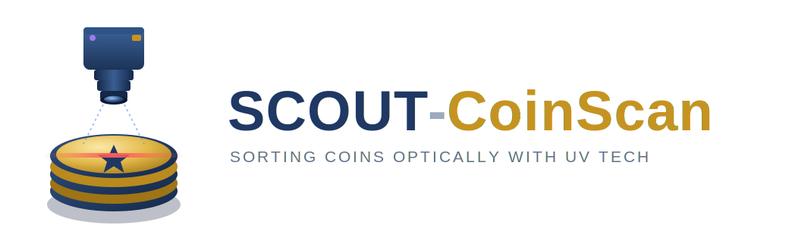

# SCOUT CoinScan

**Sorting Coins Optically with UV Technology** — an open-source coin identification, grading-assist, and sorting machine printed on the Snapmaker U1.

Entered in the **Snapmaker Innovation Fund · Open Competition Phase 1** (June–September 2026).

Repo: https://github.com/stemscoutdad/scout-coinscan

---

## What it does

Feed it a jar of mixed coins. A U1-printed singulation disk presents one coin at a time onto a gravity slide rail — no conveyor, no belt. Each coin stops on a glass platen between two cameras and is imaged on both faces simultaneously with a multispectral capture sequence: cross-polarized white light, four-direction photometric-stereo sweeps, 470/630/850 nm and 365 nm UV channels, and a swept 650 nm line-laser height profile. On-device ML (NVIDIA Jetson Orin NX 16 GB, 157 TOPS) identifies the coin, reads the date and mint mark, flags doubled dies, repunched marks, silver composition, cleaning and alteration, and estimates a condition-assist score. A servo then steers the coin into one of eight bins.

**The sort is pure software.** Sort by denomination today; by decade, mint mark, or silver content tomorrow — one config change, zero reprinting. The vision system also closes the loop on mechanical singulation: side-by-side double feeds are detected optically and recirculated to the hopper automatically.

## Why the U1 specifically

- **Co-printed TPU-on-PETG mechanisms** — hopper double-wiper, brake brushes, gate-paddle facings, V-stop pads, deflector lip: flexible features printed in place, no assembly.
- **Color as function** — multicolor drop-in calibration target at the coin plane, color-coded bins, translucent diffuser ring on an opaque lighting dome.
- **Bed finish as bearing surface** — rail sections printed face-down so the U1's bed finish becomes the coin's low-friction slide surface.

## Repository layout

```
CAD/        STEP solids + DXF face drawings (disk, platen, brackets, calibration target)
HARDWARE/   Master BOM (sourced part numbers + links), wiring notes
DOCS/       One-pager, Jetson↔Pico protocol spec, build guide (in progress)
FIRMWARE/   RP2040 Pico real-time controller — coming with the July build
SOFTWARE/   Jetson vision pipeline — coming with the July build
```

## Build tiers

| | Flagship | Budget |
|---|---|---|
| Compute | Jetson Orin NX 16 GB dev kit | Jetson Orin Nano Super 8 GB |
| Cameras | 2× 1″ Sony IMX283 20 MP (USB 3.0) | 2× IMX477 HQ 12.3 MP (CSI) |
| Focus | Motorized AF + focus stacking | Fixed focus |
| Est. cost | ~$1,650 | ~$900 |

## Safety

365 nm UV and the line laser are enclosed behind an acrylic-windowed panel with a lid interlock wired in hardware series with both supplies.

## Status

- [x] Architecture, optics geometry, sourced BOM, transport design, control protocol
- [x] Parametric CAD: singulation disk, platen frame, bracket set, calibration target
- [ ] Imaging station build + capture pipeline (July milestone)
- [ ] Transport + gate integration, classifier training (August)
- [ ] Documentation, demo video, release (early September)

## License

MIT — see [LICENSE](LICENSE).

---

*Project lead: Benjamin Flores (Chula Vista, CA) — machining/fabrication, electronics, and numismatics. This build also anchors STEM programming for a local Scouts BSA troop maker initiative. If this project is useful or interesting to you, a ⭐ helps it in the Innovation Fund community vote!*


